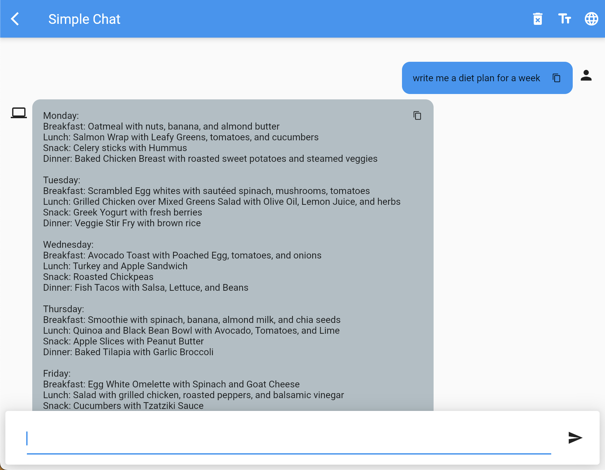

<div align="center">
     
    
    
</div>
<br />
<div align="center">
    <h1>OpenAI Gadget</h1>
</div>
<br />
Explore the potential of OpenAI models with our repository of examples showcasing use cases. Our examples highlight the diverse ways in which OpenAI models can be applied. Discover the limitations and benefits of these models and how they can be used to solve real-world problems.    

<br />

<div align="center">
    
</div>

<br />

## Summary
- [Getting started](#getting-started)
- [Specification](#specification)
    - [Basics](#basics)
    - [Demo: Simple Chat](#demo-simple-chat)
    - [Demo: Motivationals](#demo-motivationals)


## Getting Started  

Create `.env` file in the root of repository and add a single key-value pair with `OPENAI_TOKEN` as a key and your OpenAI token as a value:  
```env
OPENAI_TOKEN="YOUR_OPENAI_TOKEN"
```  

Then, generate environment files using `build_runner`:  
```console
flutter pub run build_runner build
```  

After that, run the project on any available platform 🎉  
```console
flutter run
```  

## Specification

The project has a few demonstrations of OpenAI usages in mobile applications.  

Project uses:  
- <a href="https://pub.dev/packages/envied">`envied`</a> for local secrets management.  
- <a href="https://pub.dev/packages/get_it">`get_it`</a> for dependency management.  
- <a href="https://pub.dev/packages/flutter_bloc">`flutter_bloc`</a> for state management.  
- <a href="https://pub.dev/packages/openai_client">`openai_client`</a> for <a href="https://openai.com/api/">OpenAI API</a> (<a href="https://platform.openai.com/docs">doc</a>) interactions. 

### Basics

In addition to basic localization feature, the application has an ability to change the OpenAI text model, that will be used across the app. 

<div align="center">
   
</div>

### Demo: Simple chat

This page demostrates an ability to create a simple chat to interact with user.  
It is possible to send a message and get a response from OpenAI bot.  
Application is not sending a full conversation to OpenAI, so that the text model is not aware of the context of the conversation.  

<div align="center">
   
   
</div>

### Demo: Motivationals

This page demostrates an ability to create a unique motivational message for the user.  
It is possible to generate motivational text and copy it to the clipboard.  
Such messages might be used is a certain place on user dashboard in real applications.  


<div align="center">
   
   
</div>

This demo is language-dependent, meaning that application is asking OpenAI text model to respond using the language that is currently used in application.  

<div align="center">
   
</div>